Лабораторная работа №4
====
# Цель лабораторной работы
Исследовать влияние различных техник аугментации данных на процесс обучения нейронной сети на примере решения задачи классификации Food-101 с использованием техники обучения Transfer Learning

# 1. С использованием, техники обучения Transfer Learning и оптимальной политики изменения темпа обучения, определенной в ходе выполнения лабораторной №3, обучить нейронную сеть EfficientNet-B0 (предварительно обученную на базе изображений imagenet) для решения задачи классификации изображений Food-101 с использованием следующих техник аугментации данных:
 * a) Случайное горизонтальное и вертикальное отображение
 * b) Использование случайной части изображения
 * c) Поворот на случайный угол
 
## Случайное горизонтальное и вертикальное отображение
 
В нашем случае использовалась сторонняя функция
 ```
tf.keras.layers.experimental.preprocessing.RandomFlip(...)
```
[источник](https://www.tensorflow.org/api_docs/python/tf/keras/layers/experimental/preprocessing/RandomFlip)

### Графики обучения для сети EfficientNet-B0

**График метрики точности:** 
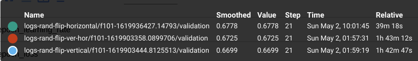
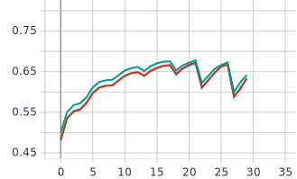

**График функции потерь:**
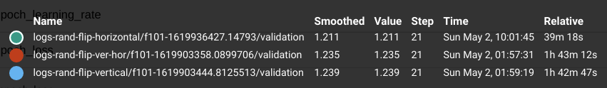
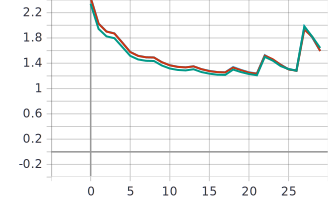

### Вывод:
Наилучшее значение точности наблюдается на зелёном графике 67,78%, что соответствует горизонтальному отражению. Все вариации функции с различными параметрами достигли максимальной точности на 21 эпохе.


## Использование случайной части изображения
 
В нашем случае использовалась сторонняя функция
```
tf.keras.layers.experimental.preprocessing.RandomCrop(...)
```
[источник](https://www.tensorflow.org/api_docs/python/tf/keras/layers/experimental/preprocessing/RandomCrop)

### Графики обучения для сети EfficientNet-B0

**График метрики точности:** 
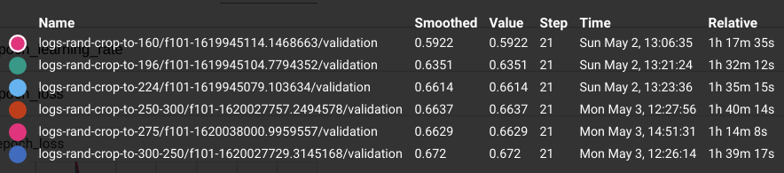
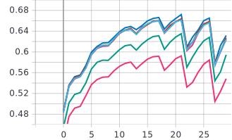

**График функции потерь:**
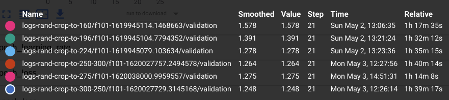
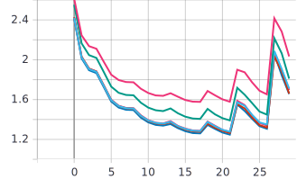

### Вывод:
Максимальное значение точности достигается при значениях кропинга 300*250 и равное 67,2% (синий график). В данном случае, пиковое значение точности так же достигается на 21 эпохе.


## Поворот на случайный угол
 
В нашем случае использовалась сторонняя функция
```
tf.keras.layers.experimental.preprocessing.RandomRotation(...)
```
[источник](https://www.tensorflow.org/api_docs/python/tf/keras/layers/experimental/preprocessing/RandomRotation)

### Графики обучения для сети EfficientNet-B0

**Графики метрики точности:** 
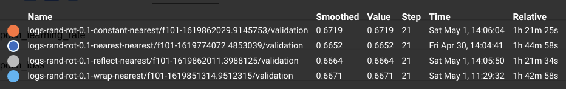
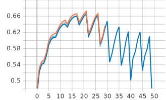

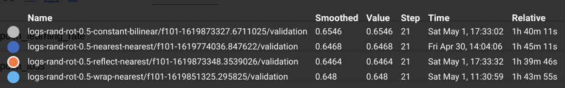
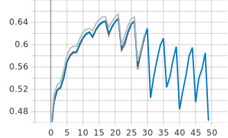

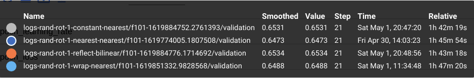
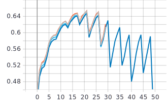

**Графики функции потерь:**
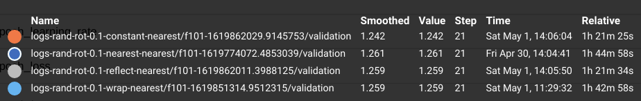
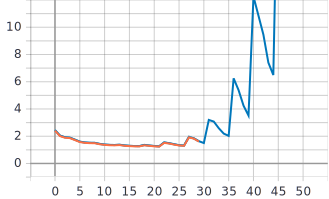

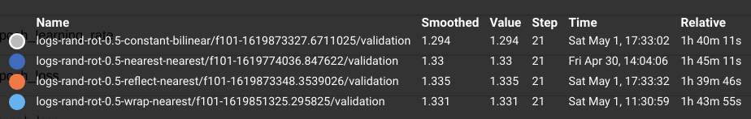


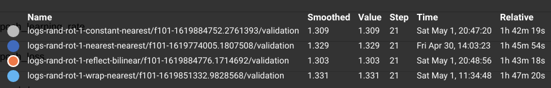
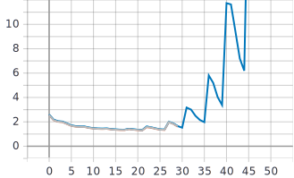

### Вывод:
В данном эксперименте наилучшее значение функции с параметром factor = 0.1 равно 67.19%, для того же значения с параметрами 0.5 и 1 значение точности уже меньше: 65,46 и 65,31 соответственно. Делая вывод из документации и графиков, при максимальной точности картинка совершает поворот в случайном направлении на 36* и заполнением фона после поворота монотонным цветом.


# 2. Обучить нейронную сеть с использованием оптимальных техник аугментации данных a-с совместно:

### Графики обучения для сети EfficientNet-B0

**Графики метрики точности:** 
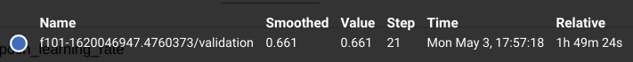
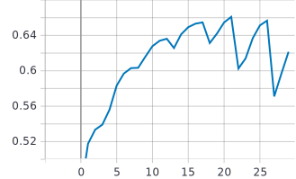

**Графики функции потерь:**
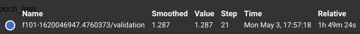
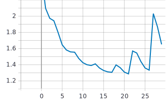

### Вывод:
Как видно из графика максимальная точность достигается на 21 и значении точности в 66,1%. 
	
# Анализ результатов
**Графики метрики точности:** 
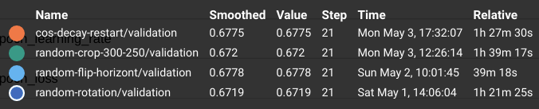
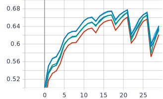

**Графики функции потерь:**
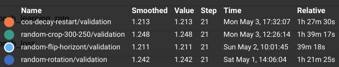
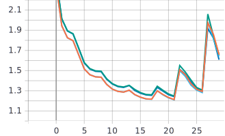

Совместное использование трёх функций: RandomCrop, RandomFlip, RandomRotation привело к снижению максимальной точности до 66,1%. При изначальных максимальных значениях равных 67,2% для RandomCrop, 67,78% для RandomFlip и 67,19% RandomRotation соответственно. Что свидетельствует тому, что одновременное использование этих методов не приводит к улучшению результатов, а наоборот ухудшает максимальное значение точности. Исходя из экспериментов и описанного выше, максимальное значение достигалось на 21 эпохе, как и исходной функцией (без функций изменения изображений) CosineDecayRestart (синий график). При этом эксперименты показали улучшение результатов маскимальной точности примерно на 0.03% (67,75% для CosineDecayRestart против 67,78% для RandomFlip). Все эксперименты проводились на батчсайзе = 32. Но также имело место влияния, других учащихся и их запусков экспериментов одновременно с моими, так как это повышает нагрузку на ядро видеокарты, что замедляет и усложняет процесс обучения. 
